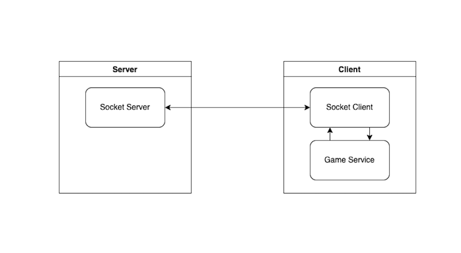

# Game of Three

## Description
A game with two independent units – the players –
communicating with each other using an API.

## Setup

### Clone
Clone the respository.

### Install

There are two parts of the application.

* Server
* Client

Use the package manager npm to install Game of Three (GOT).

To install the Server

```bash
cd server
npm install
```
To install the Client

```bash
cd client
npm install
```

### Test

For Server tests

```bash
cd server
npm test
```
For Client tests

```bash
cd client
npm test
```

## Usage
To start the ```server```, run the following command from ```server``` directory.

```bash
npm start
```
To start the ```client``` that initiates the game, run the following command from ```client``` directory.

```bash
npm start Initiator
```
To start the ```client``` the client that just plays the game, run the following command from ```client``` directory.

```bash
npm start
```
```Notes:``` 
* ```Initiator``` is an optional command line argument to select the game initiator client (player).
* Order of running the execution steps doesn't matter.
  * If the client is started before the server. There is a retry mechanism (configurable time) to check for availability of server.
  * If the server is available and one of the clients starts. It will keep on waiting for the other client. (internally server makes sure that both clients are available and then emits a "init" event.
* Server by default starts at (localhost) port ```3000```. Port on server end and Server/Port on client end is configurable using environment file.

## Configurations
It is possible to change configuration using ```client/src/utils/constants.js```.

For example, changing ```GAME_DIVISOR``` from 3 to 5 will turn ```Game of Three``` into ```Game of Five```

## Architecture Diagram


## Future Improvements
> Client Name:
>> Clients don't have identity in the application. We can introduce an option to let the user enter their name using command line arguments or during application start.

> Winner announcement:
>> Currently, once the winning condition is met, client prints it on their end. As an improvement, we can publish the winner (name) back to the server and make server broadcast this information to both clients so the other party knows who won the game. 